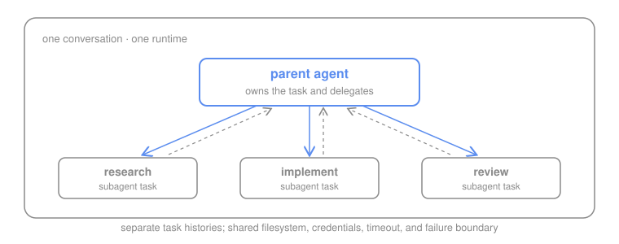
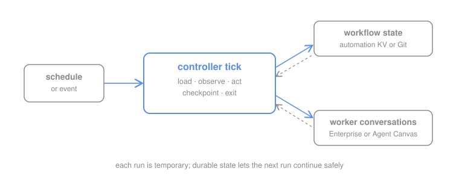
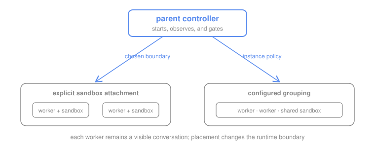
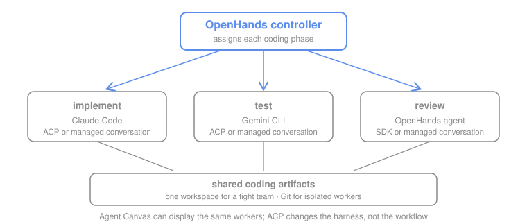

# Multi-Agent Orchestration with OpenHands

Multi-agent orchestration is not only about deciding what each agent does. You
also need to decide how agents are started, how work moves between them, and
where progress survives when a run stops. OpenHands supplies the agents,
conversations, and runtime options; you choose the control model that fits
your stack and the amount of control you need.

There are three practical starting points.

## Three Starting Points

| Approach | How it works | Execution boundary | Best for |
| --- | --- | --- | --- |
| [Software SDK orchestration](#1-software-sdk-orchestration) | Your code is the controller: it starts agents or subagents, handles handoffs, and owns workflow state. | You choose the SDK workspace or agent server. The example uses one shared runtime. | Developers who need maximum control and already have a backend or Python service. |
| [Polling and automations](#2-polling-and-automations) | A schedule or event starts an automation. Each run can perform one bounded step, trigger the next operation, or reconcile a longer workflow. | Runs can hand off through events and durable records; an optional controller can also manage Enterprise or Agent Canvas workers. | Work that arrives on schedules or events, spans runs, or naturally advances through a system of record. |
| [Parent-child conversations](#3-parent-child-conversations) | One live parent owns the request, starts first-class child conversations for bounded tasks, checks their results, and applies gates. | Enterprise children have separate conversation histories; sandbox placement follows instance configuration unless the controller explicitly prepares and attaches a sandbox. | Complex, bounded workflows that need one accountable coordinator plus visible worker records or an explicitly selected runtime boundary. |

These approaches can be combined. An automation can start an SDK controller,
and a first-class child conversation can use SDK subagents internally.

### 1. Software SDK orchestration



Your Python code creates the controller and decides when to delegate, wait,
validate, or stop. In the simplest form, one OpenHands conversation owns the
task and delegates bounded work through `TaskToolSet`.
See the [OpenHands Software Agent SDK documentation](https://docs.openhands.dev/sdk/)
for the full framework.

**Good when:** A task needs a few researchers, reviewers, test planners, or
other specialists that can safely share a filesystem, credentials, timeout,
and failure scope.

**How it is assembled:**

- **Execution:** one conversation and one runtime
- **Control:** the live parent delegates and waits for results
- **Workflow state:** parent history, subagent task IDs, and an optional final
  report

The shared-runtime example here is only one SDK composition. You can also:

- register specialized agents in Python or as
  [file-based agents](https://docs.openhands.dev/sdk/guides/agent-file-based),
  then use
  [TaskToolSet](https://docs.openhands.dev/sdk/guides/task-tool-set) for
  sequential, resumable delegation
- run independent tool or subagent calls concurrently with the SDK's
  experimental
  [parallel tool execution](https://docs.openhands.dev/sdk/guides/parallel-tool-execution)
- mix native OpenHands agents with
  [ACP-backed agents](https://docs.openhands.dev/sdk/guides/agent-acp), choose
  local or remote workspaces, and
  [persist conversations](https://docs.openhands.dev/sdk/guides/convo-persistence)
  across application runs

Start with [`shared_workspace.py`](shared_workspace.py), which contains
TaskToolSet and ACP-backed agent paths. The
[SDK subagent guidance](BEST_PRACTICES.md#sdk-subagents) explains the boundary
in more detail.

### 2. Polling and automations



A schedule, webhook, or other event starts an automation run. That run can do
one bounded operation and emit the event for the next automation, or it can
invoke a temporary controller that reloads progress, reconciles existing work,
takes a bounded action, records what happened, and exits. Polling is one
automation pattern, not a requirement.

**Good when:** Work begins on a schedule or external event, spans multiple
runs, can wait between checks, or naturally advances through a system of
record.

**How it is assembled:**

- **Execution:** one or more automation runs and agent conversations
- **Control:** direct event handoffs, scheduled or event-triggered
  reconciliation, or a combination
- **Workflow state:** any durable record appropriate to the workflow, such as
  Jira, GitHub, automation KV, Git, or an application database

#### Example: Jira story to reviewed and tested PR

A team can use several events to hand one story between independent agents:

```text
Jira story or qualifying comment
  -> build automation
  -> implementation agent opens a GitHub pull request
  -> pull-request event
  -> code-review agent posts an independent review
  -> review-passed or ready-for-QA event
  -> QA agent runs acceptance checks and reports the result
  -> Jira and GitHub receive the final status
  -> human reviews and decides whether to merge
```

This is multi-agent because each stage starts a separate bounded agent with a
different responsibility and output contract. The agents do not need to talk
directly: Jira and GitHub events provide the handoffs, while the story, branch,
pull request, review, and QA result form the durable workflow record.

Each automation records the Jira key, triggering event, worker conversation
ID, branch, and PR before acting so a retry does not create duplicate work. A
blocking review prevents the QA automation from being triggered, and a failed
QA result returns the workflow to a human or a new remediation event rather
than silently advancing it.

On a publicly reachable deployment, Jira can trigger the automation through a
webhook. A private or local deployment can run the same flow by polling Jira
on a schedule. The
[SDLC automation demo](https://github.com/rajshah4/sdlc-automation-github-demo)
shows this event-driven build, review, and QA shape as a larger
software-delivery workflow.

This repository includes polling as one concrete implementation. Inspect one
controller run without creating a conversation:

```bash
cd patterns/polling
python3 orchestrate_once.py --dry-run
```

The [polling controller example](patterns/polling/) contains that
reconciliation logic and supports Enterprise and Agent Canvas workers. An
event-driven chain such as the Jira example above does not need to use this
controller.

This can be a lower-code integration at the trigger layer, but the workflow
still needs explicit state, duplicate prevention, result validation, and
recovery behavior. Durable workflow state tells each run or downstream
automation what earlier work already did.

### 3. Parent-child conversations



A live parent accepts the initial request, breaks it into bounded assignments,
starts first-class OpenHands child conversations, observes their status,
applies gates, and produces a lifecycle report. Every worker has its own
visible conversation and fresh history; the parent carries the workflow-level
context and remains the single point of accountability. Enterprise can place
those conversations in isolated sandboxes or group trusted workers into
shared runtime capacity. Creating a first-class conversation alone does not
select either placement: the instance grouping configuration applies unless
the controller explicitly creates a sandbox and attaches the conversation.

**Good when:** Workers need separate histories, visible audit records, or
different runtime boundaries, and one parent can remain active for the
bounded lifecycle.

**How it is assembled:**

- **Execution:** first-class Enterprise conversations; configured placement by
  default, or explicit sandbox creation and attachment when required
- **Control:** one live parent starts children, waits, and applies gates
- **Workflow state:** parent run record and child IDs, with Git or tickets for
  durable artifacts

#### Example: explicitly isolated build, review, and QA

Suppose one change should move through implementation, independent review, and
QA in a single bounded run, but each role needs a different environment:

```text
request
  -> live parent
     -> implementation child: writable checkout and branch-push credentials
     -> code-review child: clean checkout and read-only PR access
     -> QA child: fresh test environment and test-only credentials
  -> lifecycle report
  -> human decides whether to merge
```

The implementation child can install dependencies and modify its checkout
without leaving residue for the reviewer. The review child evaluates the
durable branch or PR from a clean environment rather than trusting the
implementer's local files. The QA child can launch services, run browser or
integration tests, and then discard its environment without exposing its test
credentials to the other roles.

The parent passes stable identifiers, the PR URL, and small output contracts
between children; it does not treat one child's sandbox files as shared state.
A failed or stuck child is contained to its sandbox, and the parent stops at
the gate and reports what needs human attention. Isolated sandboxes consume
more capacity, so trusted children should be grouped only when sharing a
filesystem, credentials, and failure scope is acceptable.

This repository's `run_supervisor.py` demonstrates first-class conversations
and gates, but it does not prepare or attach a sandbox. Use
`start_sandbox`, `poll_sandbox`, and
`build_start_payload(sandbox_id=...)` from
[`patterns/common/openhands_conversations.py`](patterns/common/openhands_conversations.py)
when explicit placement is part of the workflow. The
[Enterprise workflow-primitives experiment](https://github.com/rajshah4/openhands-agent-research-lab/tree/main/experiments/enterprise-workflow-primitives)
contains the live Enterprise 0.24.0 evidence and end-to-end probe.

Inspect the workflow without creating conversations:

```bash
cd patterns/parent-child
python3 run_supervisor.py --dry-run
```

Then use the [parent-child example](patterns/parent-child/) with OpenHands
Cloud, Enterprise, or a self-hosted deployment.

## When Each Starting Point Fits

| Starting point | Start here when | It may look like |
| --- | --- | --- |
| Software SDK orchestration | Developers want to encode custom control logic in an existing application or service. | Application code starts agents, handles handoffs, and applies domain-specific rules. |
| Polling and automations | Work naturally begins from schedules or external events and does not need one live parent to own the entire lifecycle. | An event triggers the next automation directly, several automations form a chain, or a scheduled run invokes a reconciliation controller. |
| Parent-child conversations | One bounded request benefits from a live, accountable coordinator and workers with separate histories or chosen runtime boundaries. | The parent starts first-class conversations, checks their contracts, and gates the next child; placement remains configured unless it explicitly attaches prepared sandboxes. |

These are control starting points, not fixed execution or storage bundles.
Any of them can record progress in Git, Jira, another ticket system, automation
KV, files, or an application database. Choose the state store based on
durability, audit, concurrency, and recovery needs.

The approaches can also be combined. A scheduled automation can start an SDK
controller, an event-driven chain can launch a parent-child lifecycle, and a
first-class worker conversation can use SDK subagents internally.

## Three Parts of Multi-Agent Orchestration

Every multi-agent workflow needs answers for three parts:

| Part | What it answers | Common choices |
| --- | --- | --- |
| Agent execution | Where do agents work, and which files, credentials, compute, and failures do they share? | SDK subagents, isolated conversations, grouped conversations, Agent Canvas |
| Coordination | Who assigns tasks, checks results, and decides what happens next? | Live parent, polling controller, scheduled automation, event-triggered controller, persistent reconciler |
| Workflow state | Where are tasks, attempts, results, and active work recorded so the workflow can continue? | Automation KV, Git, issues or tickets, application database |

A conversation and a sandbox are different boundaries. A conversation owns
history, identity, and an operator-visible record. A sandbox owns compute,
filesystem, credentials, and a failure domain.

Likewise, an automation starts a bounded run; it does not prescribe how the
whole workflow is coordinated. Runs can hand off through events or invoke a
controller. Either way, the workflow still needs task assignment, capacity
limits, result validation, and durable progress.

### Agent execution: choose the boundary

Execution determines what agents share: conversation history, filesystem,
credentials, compute, timeout, and failure scope.

| Execution option | Boundary | Good when | Important limit |
| --- | --- | --- | --- |
| SDK subagents | Task-specific histories inside one parent conversation and runtime | A bounded task needs a few trusted specialists | Files, credentials, resources, timeout, and failures are shared |
| Isolated Enterprise conversations | Each worker has a first-class conversation and sandbox | Workers cross trust, credential, tenant, or failure boundaries | Uses the most sandbox capacity; results must travel through durable artifacts or contracts |
| Grouped Enterprise conversations | Conversation histories are separate; trusted workers share a sandbox | Auditability matters, but workers can safely share runtime capacity | Grouping is not security isolation; one owner must manage the shared sandbox lifecycle |
| Agent Canvas | Conversations are separately visible; workspace and credential sharing depend on the backend | A trusted team wants local or Kubernetes-hosted workers and a visual conversation graph | Canvas provides execution and visibility, not campaign durability by itself |

Use a conversation as the ownership, history, and audit boundary. Use a
sandbox as the filesystem, credential, compute, and failure boundary. They are
related, but they are not the same decision.

**Code examples:**

- SDK subagents and ACP-backed workers:
  [`shared_workspace.py`](shared_workspace.py)
- Isolated Enterprise conversations:
  the explicit sandbox controls in
  [`patterns/common/openhands_conversations.py`](patterns/common/openhands_conversations.py)
  and the
  [verified Enterprise probe](https://github.com/rajshah4/openhands-agent-research-lab/tree/main/experiments/enterprise-workflow-primitives)
- First-class Enterprise conversations with configuration-driven placement:
  [parent-child supervisor](patterns/parent-child/run_supervisor.py)
- Grouped Enterprise conversations:
  [sandbox-grouping experiment](https://github.com/rajshah4/openhands-agent-research-lab/tree/main/experiments/enterprise-sandbox-grouping)
- Agent Canvas conversations:
  [`patterns/common/canvas_conversations.py`](patterns/common/canvas_conversations.py)
  and the
  [Kubernetes controller example](https://github.com/rajshah4/openhands-agent-research-lab/tree/main/experiments/agent-canvas-kubernetes/controller)

### Coordination: choose who advances the work

Coordination determines what observes the current state, assigns the next
task, checks the result, and decides whether the workflow may continue.

| Coordination option | How work advances | Good when |
| --- | --- | --- |
| Application controller or live parent | One owner remains active, starts workers, waits, and applies gates | One bounded request should finish while an accountable coordinator remains available |
| Direct event handoffs | A completed stage changes Jira, GitHub, or another system of record, which triggers the next automation | Stages have natural external events and no central process needs to remain alive |
| Scheduled or event-triggered reconciliation | A temporary controller observes durable state, takes a bounded action, checkpoints, and exits | Work spans runs, events can be delayed or duplicated, or periodic recovery is useful |
| Persistent reconciler | A monitored service continuously observes work and capacity | A sustained queue needs low-latency admission, retries, and recovery |

These patterns can coexist. An event can start a parent, a scheduled
reconciliation run can repair a missed event handoff, and an application
controller can use automations for external triggers.

**Code examples:**

- Live parent with gates:
  [`patterns/parent-child/run_supervisor.py`](patterns/parent-child/run_supervisor.py)
- Direct event handoffs:
  [GitHub automation work cells](https://github.com/rajshah4/sdlc-automation-github-demo/tree/main/automations/github)
  and their
  [registration script](https://github.com/rajshah4/sdlc-automation-github-demo/blob/main/scripts/automations/register_github_automations.py)
- Restartable reconciliation:
  [`patterns/polling/orchestrate_once.py`](patterns/polling/orchestrate_once.py)
  and the
  [in-platform controller experiment](https://github.com/rajshah4/openhands-agent-research-lab/tree/main/experiments/in-platform-controller)
- Long-lived controller:
  [bounded persistent supervisor experiment](https://github.com/rajshah4/openhands-agent-research-lab/blob/main/experiments/in-platform-controller/persistent_supervisor.py)

### Workflow state: choose what survives

Workflow state records ownership, attempts, worker IDs, artifacts, validation
results, and the next permitted action. Conversation history can help one
agent reason, but it should not be the only campaign record.

| State option | Good when | Important limit |
| --- | --- | --- |
| Local files | One local controller owns a bounded demo | Files disappear with an ephemeral controller and do not provide concurrent claims |
| OpenHands automation KV | One automation needs checkpoints across temporary runs | It is not a general multi-controller lease service |
| Files plus Git | One serialized controller needs reviewable, restartable checkpoints | Git is not a transactional queue |
| Jira, GitHub, or another ticket system | Work naturally advances through stories, comments, branches, pull requests, labels, or statuses | Poor fit for frequent leases and heartbeats |
| Application database | Multiple controllers or tenants claim work concurrently | Adds schema, migration, backup, and operational responsibility |

A workflow can use more than one. For example, Jira can own the request,
GitHub can own the code and review artifacts, and automation KV can retain
event-deduplication checkpoints and active conversation IDs.

**Code examples:**

- Local file-backed state:
  [`patterns/polling/orchestrate_once.py`](patterns/polling/orchestrate_once.py)
  and its [`backlog.json`](patterns/polling/backlog.json)
- Jira and GitHub as systems of record:
  [SDLC automation packages](https://github.com/rajshah4/sdlc-automation-github-demo/tree/main/automations)
- Git-backed controller ledger:
  [in-platform controller](https://github.com/rajshah4/openhands-agent-research-lab/tree/main/experiments/in-platform-controller)
- Persistent-volume state for one Kubernetes controller:
  [Agent Canvas controller](https://github.com/rajshah4/openhands-agent-research-lab/tree/main/experiments/agent-canvas-kubernetes/controller)
- Transactional database or lease service:
  [design guidance](BEST_PRACTICES.md#separate-single-controller-and-multi-controller-state);
  this repository does not yet include a working multi-controller database
  implementation

### Compose the three choices

For a more complex workflow, write the architecture down before implementing
it:

```text
execution:
coordination:
workflow state:
active-work limit:
validation:
cleanup owner:
human gate:
scale-out boundary:
```

For the Jira-to-PR example, one valid composition is isolated Enterprise
conversations for build, review, and QA; direct Jira and GitHub event
handoffs; Jira plus GitHub as the durable workflow record; automation KV for
deduplication; independent review and QA contracts; and a human merge gate.
That is one composition, not a required bundle.

See [Multi-Agent Best Practices](BEST_PRACTICES.md) for stable identifiers,
attempt ledgers, idempotent dispatch, capacity, validation, recovery, cleanup,
and production qualification.

## Alternative Coding Agents and Harnesses

A multi-agent coding team does not need to use the same agent harness for
every role. One worker can implement with Claude Code, another can test with
Gemini CLI, and an OpenHands agent can review the result. OpenHands coordinates
the phases while each worker uses the coding agent best suited to its task.



This is an agent-execution choice. It is separate from the coordination and
workflow-state choices described above.

### Two ways to invoke an alternative coding agent

| Integration | How it works | Use it when |
| --- | --- | --- |
| Command line | An OpenHands worker launches the coding agent's headless CLI inside its workspace or sandbox, then the orchestrator validates the resulting files, commit, or structured response | The CLI is already available in the runtime, or the harness does not expose ACP |
| ACP | OpenHands configures an ACP-backed agent and communicates with its server through the [Agent Client Protocol](https://agentclientprotocol.com/overview/introduction) | The coding agent supports ACP and should behave as a reusable conversation backend rather than a one-off command |

The [OpenHands ACP guide](https://docs.openhands.dev/sdk/guides/agent-acp)
shows both local `ACPAgent` usage and ACP agents running through remote agent
servers. ACP is not specific to Agent Canvas: both OpenHands Enterprise and
[Agent Canvas](https://github.com/OpenHands/agent-canvas) can run ACP-backed
agents. Calling a harness through its CLI or through ACP changes how the worker
is invoked; it does not decide when the worker runs, how its result is
validated, or where workflow progress is stored.

### Enterprise or Agent Canvas?

Agent Canvas does not need a separate multi-agent orchestration pattern. Use
the same execution, coordination, and workflow-state framework for both
platforms, then choose the operating environment that fits the team:

| Platform | Choose it when |
| --- | --- |
| Agent Canvas | Developers want a self-hosted visual control center for local, remote, or cloud agent backends and want to inspect or operate conversations directly |
| OpenHands Enterprise | An organization needs centrally managed conversations, integrations, access controls, auditability, and scalable sandbox execution |

The platform and harness choices are independent. An Enterprise or Agent
Canvas worker can use the native OpenHands agent or an ACP-backed coding agent.
The sandbox, credentials, and repository boundary still need to be selected
for each worker. The parent-child and polling examples accept
`--agent-profile-id` on both runtimes.

### Working examples

| Example | Integration shown | Coding team | Execution boundary |
| --- | --- | --- | --- |
| [`shared_workspace.py`](shared_workspace.py) | ACP through the OpenHands SDK | Claude Code implements, Gemini CLI tests, OpenHands reviews | All roles use one shared workspace |
| [`cloud_conversations.py`](cloud_conversations.py) | Coding-agent CLIs launched inside managed conversations | Claude Code implements, Gemini CLI tests, OpenHands reviews | Each role uses a managed conversation and transfers code through Git |

These examples demonstrate the two invocation methods, not a complete
Enterprise-versus-Agent-Canvas matrix. This repository does not yet include
equivalent end-to-end ACP multi-agent demos for both platforms.

## Example Compositions

These are example combinations, not required pairings. The first three rows
have working implementations. The last two are useful design directions for
workloads that exceed the simple examples.

| Combination | Good when | Execution | Control | Workflow state | Implementation |
| --- | --- | --- | --- | --- | --- |
| Shared SDK subagent demo | One bounded task needs a few trusted specialists | One shared runtime | Live parent | Parent history and task IDs | [`shared_workspace.py`](shared_workspace.py) |
| Polling controller demo | Work continues across temporary runs | Enterprise or Agent Canvas workers | Reconciliation run started by a schedule or event | Automation KV or Git | [`patterns/polling`](patterns/polling/) |
| Enterprise parent-child demo | Workers need separate histories and visible records | First-class conversations; placement follows Enterprise configuration | Live parent | Run record, child IDs, and durable artifacts | [`patterns/parent-child`](patterns/parent-child/) |
| Grouped Enterprise controller | Trusted workers need separate conversations but can share runtime capacity | Grouped conversations | Live or scheduled controller | Git, automation KV, tickets, or database | [Implementation guidance](BEST_PRACTICES.md#grouped-enterprise-conversations) |
| Persistent controller with database leases | Several controllers or tenants must claim work concurrently | First-class worker conversations | Monitored reconciler replicas | Application database with atomic claims | [State guidance](BEST_PRACTICES.md#separate-single-controller-and-multi-controller-state) |

The grouped Enterprise combination was validated in the
[sandbox-grouping experiment](https://github.com/rajshah4/openhands-agent-research-lab/tree/main/experiments/enterprise-sandbox-grouping).
The database-leasing row is architecture guidance, not a completed example in
this repository.

## Best Practices

The [multi-agent best practices](BEST_PRACTICES.md) document contains the
operating guidance behind these examples:

- stable workflow, task, and attempt identifiers
- append-only attempt records
- idempotent dispatch and duplicate prevention
- bounded concurrency and queueing
- independent result validation
- controller recovery and durable artifacts
- one clear owner for grouped sandbox cleanup
- human gates for irreversible actions

These practices came from the working repository examples and the larger
NeuroGolf orchestration experiments rather than from the small demo tasks
alone.

## Reuse The Orchestration Skill

This repository includes a shareable
[`orchestrate-multi-agent-conversations`](.agents/skills/orchestrate-multi-agent-conversations/)
skill. It guides an agent through execution boundaries, native/CLI/ACP worker
selection, coordination, durable state, contracts, recovery, capacity, and
human gates.

Keep the directory under `.agents/skills/` to use it in this repository. To
reuse it elsewhere, copy the complete skill directory into that project's
`.agents/skills/` directory, then ask the agent to use
`$orchestrate-multi-agent-conversations` for the workflow. Keep its references
and validator script with `SKILL.md`; they are part of the skill.

## Repository Map

```text
patterns/
  common/          Enterprise and Agent Canvas conversation adapters
  parent-child/    Live controller with bounded child conversations
  polling/         Restartable reconciliation run and file-backed demo state
shared_workspace.py        ACP coding team in one shared workspace
cloud_conversations.py     Coding harnesses in managed conversations
BEST_PRACTICES.md  Architecture, state, recovery, validation, and scaling
.agents/skills/
  orchestrate-multi-agent-conversations/  Shareable design and validation skill
tests/
```

The example tasks are intentionally small so the orchestration is easy to
inspect. Replace their prompts and validators with your workload while keeping
the controller, workflow state, capacity limits, output contracts, and human
approval boundaries.

## Go Deeper

- [Multi-agent best practices](BEST_PRACTICES.md): architecture, workflow
  state, identifiers, recovery, validation, capacity, and cleanup
- [Parent-child example](patterns/parent-child/): a bounded live controller
  with gated child conversations
- [Polling example](patterns/polling/): a restartable single-controller
  reconciliation tick
- [OpenHands ACP guide](https://docs.openhands.dev/sdk/guides/agent-acp):
  alternative coding agents locally or through remote agent servers
- [Shareable orchestration skill](.agents/skills/orchestrate-multi-agent-conversations/):
  architecture selection, worker contracts, recovery, and validation
