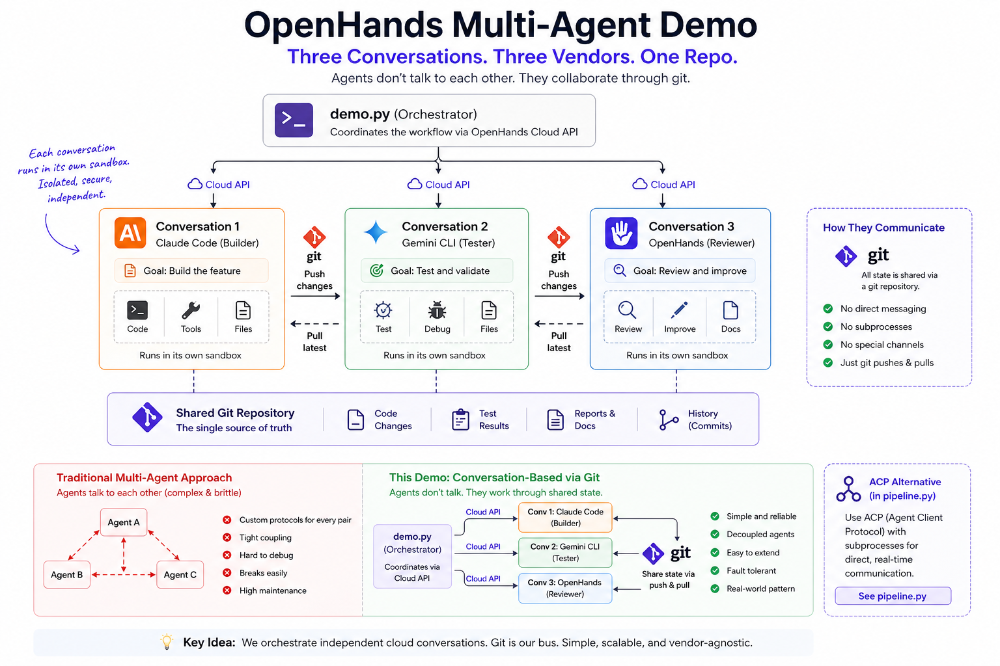

# Multi-Agent Orchestration with OpenHands

> Three vendors, one pipeline — OpenHands orchestrates Claude Code, Gemini CLI,
> and its own agents to implement, test, and review code.



## Why Multi-Agent Orchestration?

An **agent harness** wraps a model with tools, context, and execution —
Claude Code, Gemini CLI, and OpenHands are all harnesses. Each has different
strengths: Claude Code for implementation, Gemini CLI for fast test generation,
OpenHands for code review with its own agent framework.

This demo uses OpenHands as the orchestration layer that coordinates all three.
The same implement → test → review pipeline runs across vendors, and you can
swap any harness without changing the pipeline. The point isn't that you *need*
three vendors — it's that you *can*, and OpenHands makes them composable.

## The Pipeline

Every demo in this repo runs the same three-phase pipeline:

| Phase | Default Harness | What it does |
|-------|-----------------|--------------|
| **Implement** | Claude Code (Anthropic) | Writes the code from a spec |
| **Test** | Gemini CLI (Google) | Reads the code, writes and runs pytest tests |
| **Review** | OpenHands | Reviews everything, reports findings with severity |

You can swap any harness — run `--no-claude` to use OpenHands for all phases.

## Three Patterns for Multi-Agent Orchestration

This repo demonstrates **three architectural patterns** for running multiple agents.
They produce the same output but differ in isolation, complexity, and infrastructure.

📖 **[Read the full patterns guide →](PATTERNS.md)** for detailed architecture explanations,
decision trees, and migration paths.

### Pattern Comparison

| | **Pattern 1: Easy** | **Pattern 2: Isolated Local** | **Pattern 3: Enterprise** |
|---|---|---|---|
| **Script** | `shared_workspace.py` | `multi_server_isolation.py` | `cloud_conversations.py` |
| **Sandboxes** | 1 shared | N isolated (manual) | N isolated (automatic) |
| **Agent-Servers** | 1 instance | N instances | Enterprise-managed |
| **Coordination** | Filesystem | Git (you orchestrate) | Git (Enterprise orchestrates) |
| **Code complexity** | ~10 lines | ~150 lines | ~50 lines |
| **Infrastructure** | None | Manual server management | Automatic provisioning |
| **Observability** | Terminal logs | Terminal logs | Web UI per agent |

---

### When to Use Each Pattern

**Pattern 1 (Easy)** — Agents share a workspace, simple code
- ✅ Quick local development
- ✅ Agents collaborate on same files
- ✅ Minimal infrastructure
- ❌ No isolation between agents

**Pattern 2 (Isolated Local)** — Full isolation, manual orchestration  
- ✅ Complete isolation without Cloud
- ✅ Air-gapped environments
- ❌ You manage multiple servers, ports, and git coordination
- ❌ More complex orchestration code

**Pattern 3 (Enterprise)** — Full isolation, automatic orchestration
- ✅ Isolation + simple code
- ✅ Automatic sandbox provisioning
- ✅ Web UI for each agent
- ❌ Requires internet and Enterprise API key

## Pattern 1: Easy — Single Agent-Server (`shared_workspace.py`)

All agents run in a **single shared workspace** using the
[OpenHands SDK](https://docs.openhands.dev/sdk/overview). Claude Code and
Gemini CLI connect as subprocesses via
[ACP (Agent Client Protocol)](https://docs.agentclientprotocol.com/).

```
shared_workspace.py (your laptop)
│
└─► Single Agent-Server (one workspace)
     ├─ Agent 1 [Claude Code]  → writes shortener.py
     ├─ Agent 2 [Gemini CLI]   → writes test_shortener.py
     └─ Agent 3 [OpenHands]    → reviews all files
        
        All share /workspace/project ✅
```

**Architecture:** One sandbox, agents coordinate via shared filesystem.

**Best for:** Quick local development, tight collaboration, minimal infrastructure.

### Setup and Run

```bash
git clone https://github.com/rajshah4/openhands-multi-agent-demo.git
cd openhands-multi-agent-demo

pip install openhands-sdk openhands-tools
export LLM_API_KEY="your-key"
export ANTHROPIC_API_KEY="your-key"
export GEMINI_API_KEY="your-key"

python shared_workspace.py               # ACP pipeline with all three harnesses
python shared_workspace.py --no-claude   # Pure OpenHands agent delegation
python shared_workspace.py --cloud       # Run on Cloud infrastructure (still single sandbox)
```

When run with `--no-claude`, the SDK uses `DelegateTool` to spawn OpenHands
subagents — the LLM decides the flow rather than a hardcoded script.

---

## Pattern 2: Isolated Local — Multiple Agent-Servers (`multi_server_isolation.py`)

Each agent runs in its **own isolated workspace** with different temporary directories.
You manually orchestrate git push/pull between isolated workspaces.

```
multi_server_isolation.py (your laptop)
│
├─► Agent 1 [Claude Code]  → /tmp/workspace_claude/
│     └─ Implements shortener.py → git push
│
├─► Agent 2 [Gemini CLI]   → /tmp/workspace_gemini/  
│     └─ git pull → writes tests → git push
│
└─► Agent 3 [OpenHands]    → /tmp/workspace_reviewer/
      └─ git pull → reviews code
```

**Architecture:** Multiple isolated workspaces, manual git coordination.
Each agent has its own directory, you coordinate changes via git.

**Best for:** Air-gapped environments, custom orchestration, learning how to build multi-agent systems.

**Trade-off:** Full isolation but requires ~300 lines of orchestration code to
manage workspaces and git coordination.

### Setup and Run

```bash
# Prerequisites: Same as Pattern 1 (ANTHROPIC_API_KEY, GEMINI_API_KEY)
pip install openhands-ai

python multi_server_isolation.py                    # Run full pipeline
python multi_server_isolation.py --no-claude        # OpenHands only
python multi_server_isolation.py --task csv-tool    # Different task
```

---

## Pattern 3: Enterprise — Automatic Multi-Sandbox (`cloud_conversations.py`)

Each agent runs in its **own sandbox** on OpenHands Cloud or Enterprise (self-hosted).
The platform automatically provisions sandboxes, handles git coordination, and provides 
web UI for each agent.

```
cloud_conversations.py (your laptop)
│
├─► ☁️ Conversation 1   [Claude Code / Anthropic]
│     └─ Platform provisions sandbox, implements, pushes to repo
│
├─► ☁️ Conversation 2   [Gemini CLI / Google]
│     └─ Platform provisions sandbox, pulls, tests, pushes
│
└─► ☁️ Conversation 3   [OpenHands]
      └─ Platform provisions sandbox, pulls, reviews
```

**Architecture:** Enterprise-managed sandboxes, automatic orchestration.
You write high-level workflow, the platform handles infrastructure.

**Best for:** Production workflows, observability, auditability, team deployments.

### Setup and Run

```bash
# Prerequisites: ANTHROPIC_API_KEY and GEMINI_API_KEY configured in platform
# Get an API key from https://app.all-hands.dev → Settings → API Keys (Cloud)
# Or from your self-hosted Enterprise instance

pip install requests
export OPENHANDS_CLOUD_API_KEY="your-cloud-api-key"

python cloud_conversations.py                          # default: url-shortener
python cloud_conversations.py --task csv-tool          # CSV-to-JSON converter
python cloud_conversations.py --task custom --custom-task "Build a rate limiter"
python cloud_conversations.py --repo youruser/yourrepo # your own repo
python cloud_conversations.py --no-claude              # OpenHands for all steps
```

You'll see three conversation URLs — click each one to watch that agent work live
in the [Cloud UI](https://app.all-hands.dev).

**Value:** Same isolation as Pattern 2 (multi-server) but with ~50 lines of code
instead of ~150. Cloud handles sandbox provisioning, cleanup, and observability.

---

## Demo Results

Output from a Pattern 3 (Enterprise) run (April 2026):

| Phase | Harness | Cost | Output |
|-------|---------|------|--------|
| Implement | Claude Code | $0.048 | `shortener.py` — URL shortener with `shorten()`, `resolve()`, `stats()` |
| Test | Gemini CLI | $0.000 | `test_shortener.py` + additional test files — 17 pytest tests |
| Review | OpenHands | $0.338 | 12 findings including command injection vuln and hash collision bug |
| **Total** | **3 vendors** | **$0.39** | |

---

## Files

| File | What it does |
|------|--------------|
| `cloud_conversations.py` | **Pattern 3** — Enterprise conversations via API (automatic multi-sandbox) |
| `shared_workspace.py` | **Pattern 1** — SDK with ACP (single shared workspace) |
| `multi_server_isolation.py` | **Pattern 2** — Isolated workspaces with manual git orchestration |
| `shortener.py` | Sample output — URL shortener generated by the pipeline |
| `.agents/agents/code-reviewer.md` | File-based agent definition for the reviewer |

---

## Architecture Insights

### Why Three Patterns?

Each pattern represents a different **isolation vs. complexity** trade-off:

**Pattern 1** is the "Goldilocks" for local development:
- ✅ Simple (~10 lines)
- ✅ Fast (no network calls)
- ✅ All SDK features (DelegateTool, ACP, file-based agents)
- ❌ No isolation (agents share filesystem)

**Pattern 2** provides local isolation but at high cost:
- ✅ Full isolation (separate agent-servers)
- ✅ Air-gapped capability
- ❌ Complex (~150 lines to orchestrate)
- ❌ Manual server/port/git management

**Pattern 3** is the "Goldilocks" for production:
- ✅ Full isolation (Cloud provisions sandboxes)
- ✅ Simple (~50 lines)
- ✅ Observability (Web UI per agent)
- ✅ Automatic orchestration
- ❌ Requires Cloud connectivity

### The Key Insight

**Cloud conversations (Pattern 3) = Isolation (Pattern 2) + Simplicity (Pattern 1)**

You get the full sandbox isolation of Pattern 2 without the orchestration
complexity. Cloud handles:
- ✅ Sandbox provisioning and cleanup
- ✅ Port management
- ✅ Git integration
- ✅ Observability (Web UI)
- ✅ Error recovery

This is why `cloud_conversations.py` is only ~50 lines while a local multi-server equivalent
(`multi_server_isolation.py`) would be ~150 lines.

---

## Enterprise Value

- **Multi-vendor flexibility** — Anthropic implements, Google tests, OpenHands reviews
- **Observable workflows** — Each agent in its own conversation, fully auditable
- **Distributed architecture** — Agents communicate through artifacts (git), not tight coupling
- **Vendor-agnostic** — Swap any agent without changing the pipeline
- **Extensible** — Add new harnesses by adding entries to `HARNESS_INSTRUCTIONS`
- **Cost-effective** — Full implement + test + review pipeline for under $0.40
- **Pattern flexibility** — Start local (Pattern 1), scale to Cloud (Pattern 3)

## Links

- [OpenHands Cloud](https://app.all-hands.dev) — run and observe agent conversations
- [OpenHands SDK docs](https://docs.openhands.dev/sdk/overview) — build agent pipelines in Python
- [Agent Client Protocol (ACP)](https://docs.agentclientprotocol.com/) — the protocol connecting harnesses
- [The Rise of Subagents](https://www.philschmid.de/the-rise-of-subagents) — why isolating tasks into focused agents improves reliability
