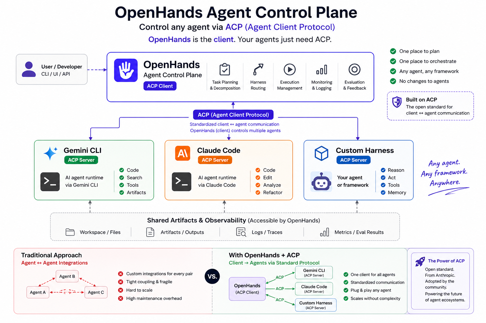

# Multi-Agent Orchestration with OpenHands

> Three vendors, one pipeline — OpenHands orchestrates Claude Code, Gemini CLI,
> and its own agents to implement, test, and review code.


## Why Multi-Harness?

An **agent harness** wraps a model with tools, context, and execution —
Claude Code, Gemini CLI, and OpenHands are all harnesses. Each has different
strengths: Claude Code for implementation, Gemini CLI for fast test generation,
OpenHands for code review with its own agent framework.

This demo uses OpenHands as the orchestration layer that coordinates all three.
The same implement → test → review pipeline runs across vendors, and you can
swap any harness without changing the pipeline. The point isn't that you *need*
three vendors — it's that you *can*, and OpenHands makes them composable.

## The Pipeline

Every demo in this repo runs the same three-phase pipeline:

| Phase | Default Harness | What it does |
|-------|-----------------|--------------|
| **Implement** | Claude Code (Anthropic) | Writes the code from a spec |
| **Test** | Gemini CLI (Google) | Reads the code, writes and runs pytest tests |
| **Review** | OpenHands | Reviews everything, reports findings with severity |

You can swap any harness — run `--no-claude` to use OpenHands for all phases.

## Two Ways to Run It

This repo provides two approaches to the same pipeline. They use the same
harnesses and produce the same output, but differ in how agents are deployed
and orchestrated.

### Approach 1: Cloud Conversations (`demo.py`)

Each agent runs in its **own OpenHands Cloud sandbox**. Your laptop sends
API calls to start each conversation. Agents communicate through the git repo —
one pushes code, the next pulls and adds to it.

```
demo.py (your laptop)
│
├─► ☁️ Conversation 1   [Claude Code / Anthropic]
│     └─ implements shortener.py, pushes to repo
│
├─► ☁️ Conversation 2   [Gemini CLI / Google]
│     └─ pulls repo, writes test_shortener.py, pushes
│
└─► ☁️ Conversation 3   [OpenHands]
      └─ pulls repo, reviews all .py files
```

**Best for:** Observability and auditability. Each conversation is visible in the
[Cloud UI](https://app.all-hands.dev) — you can watch agents work in real time,
inspect each sandbox, and audit the full trajectory. Agents are fully isolated.

```bash
# Prerequisites: ANTHROPIC_API_KEY and GEMINI_API_KEY as Cloud secrets
# Get a Cloud API key from https://app.all-hands.dev → Settings → API Keys

git clone https://github.com/rajshah4/openhands-multi-agent-demo.git
cd openhands-multi-agent-demo

pip install requests
export OPENHANDS_CLOUD_API_KEY="your-cloud-api-key"

python demo.py
```

You'll see three conversation URLs — click each one to watch that agent work live.

<details>
<summary><strong>Options</strong></summary>

```bash
python demo.py                          # default: url-shortener
python demo.py --task csv-tool          # CSV-to-JSON converter
python demo.py --task custom --custom-task "Build a rate limiter"
python demo.py --repo youruser/yourrepo # your own repo
python demo.py --no-claude              # OpenHands for all steps
```

</details>

### Approach 2: SDK with ACP (`pipeline.py`)

All agents run in a **single process** using the
[OpenHands SDK](https://docs.openhands.dev/sdk/overview). Claude Code and
Gemini CLI connect as subprocesses via
[ACP (Agent Client Protocol)](https://docs.agentclientprotocol.com/) — a
JSON-RPC 2.0 protocol over stdio. The SDK orchestrator delegates work to each
harness, collects results, and coordinates the pipeline.



**Best for:** Agent-driven orchestration. The SDK lets an LLM decide how to
decompose work and delegate to subagents. It also supports file-based agent
definitions (like `.agents/agents/code-reviewer.md`) and built-in agents for
common tasks.

```bash
pip install openhands-sdk openhands-tools
export LLM_API_KEY="your-key"
export ANTHROPIC_API_KEY="your-key"
export GEMINI_API_KEY="your-key"

python pipeline.py               # ACP pipeline with all three harnesses
python pipeline.py --no-claude   # Pure OpenHands agent delegation
python pipeline.py --cloud       # Run SDK pipeline on Cloud infrastructure
```

When run with `--no-claude`, the SDK orchestrator uses `DelegateTool` to spawn
subagents (an implementer and a code-reviewer) — the LLM decides the flow rather
than a hardcoded script.

### Comparing the Two Approaches

| | Cloud Conversations | SDK with ACP |
|---|---|---|
| **Script** | `demo.py` | `pipeline.py` |
| **Who orchestrates** | Python script (hardcoded sequence) | LLM via DelegateTool (agent-driven) |
| **Agent isolation** | Full sandboxes (one per agent) | Shared filesystem (single process) |
| **Communication** | Git repo (push/pull) | Filesystem + ACP messages |
| **Observability** | Each conversation in Cloud UI | Delegation tree in terminal |
| **Dependencies** | Just `requests` | `openhands-sdk`, `openhands-tools` |
| **Multi-vendor** | ✅ via Cloud secrets | ✅ via ACP subprocess agents |

## Demo Results

Output from a run on OpenHands Cloud (April 2026):

| Phase | Harness | Cost | Output |
|-------|---------|------|--------|
| Implement | Claude Code | $0.048 | `shortener.py` — URL shortener with `shorten()`, `resolve()`, `stats()` |
| Test | Gemini CLI | $0.000 | `test_shortener.py` + additional test files — 17 pytest tests |
| Review | OpenHands | $0.338 | 12 findings including command injection vuln and hash collision bug |
| **Total** | **3 vendors** | **$0.39** | |

## Files

| File | What it does |
|------|--------------|
| `demo.py` | Cloud conversations approach — starts 3 conversations via Cloud API |
| `pipeline.py` | SDK approach — orchestrates harnesses via ACP and DelegateTool |
| `shortener.py` | Sample output — URL shortener generated by the pipeline |
| `.agents/agents/code-reviewer.md` | File-based agent definition for the reviewer (used by `pipeline.py`) |

## Enterprise Value

- **Multi-vendor** — Anthropic implements, Google tests, OpenHands reviews
- **Observable** — Each agent in its own conversation, fully auditable in Cloud UI
- **Distributed** — Agents communicate through artifacts (git), not tight coupling
- **Vendor-flexible** — Swap any agent without changing the pipeline
- **Extensible** — Add new harnesses by adding entries to `HARNESS_INSTRUCTIONS`
- **Cost-effective** — Full implement + test + review pipeline for under $0.40

## Links

- [OpenHands Cloud](https://app.all-hands.dev) — run and observe agent conversations
- [OpenHands SDK docs](https://docs.openhands.dev/sdk/overview) — build agent pipelines in Python
- [Agent Client Protocol (ACP)](https://docs.agentclientprotocol.com/) — the protocol connecting harnesses
- [The Rise of Subagents](https://www.philschmid.de/the-rise-of-subagents) — why isolating tasks into focused agents improves reliability
