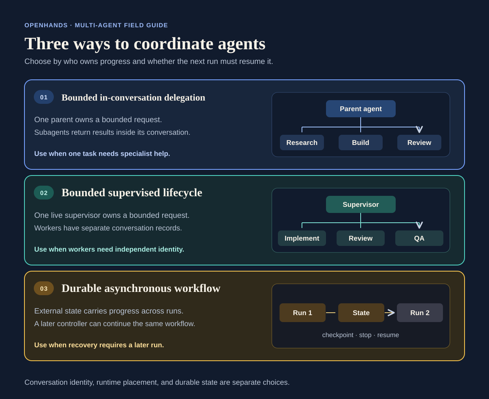
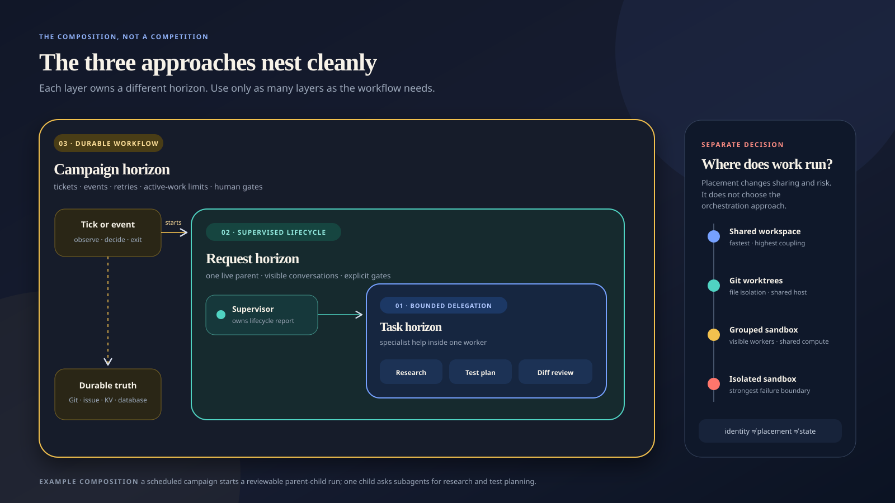

# Multi-Agent Orchestration with OpenHands

This repository shows practical ways to coordinate multiple OpenHands agents.
The examples focus on the decisions that make a multi-agent system reliable:
who owns progress, where workers run, how results move between them, and where
workflow state survives when a controller stops.

The examples are intentionally small. Use them to learn the control boundaries,
then replace the demo prompts, state, and validation with your own workflow.

## Start Here

There are three approaches. Choose one by controller lifetime and worker
identity, not by product name or sandbox placement:

| Approach | Start here when | Working example |
| --- | --- | --- |
| [1. Bounded in-conversation delegation](#1-bounded-in-conversation-delegation) | One parent run needs bounded specialist help and can wait for the result. | [`shared_workspace.py`](shared_workspace.py), native `TaskToolSet` path |
| [2. Bounded supervised lifecycle](#2-bounded-supervised-lifecycle) | One request needs an accountable supervisor plus separately visible workers and gates. | [`patterns/parent-child`](patterns/parent-child/) |
| [3. Durable asynchronous workflow](#3-durable-asynchronous-workflow) | The same workflow must resume after any one controller run ends. | [`patterns/polling`](patterns/polling/) |



The approaches compose. A durable workflow can launch a bounded supervised
lifecycle, and any child conversation can use in-conversation delegation for
smaller specialist tasks.

If you want to inspect the runnable controllers without creating a
conversation, start with their dry runs:

```bash
# Approach 3A: a restartable reconciliation tick
cd patterns/polling
python3 orchestrate_once.py --dry-run

# Approach 2: a live supervisor with gated child assignments
cd ../parent-child
python3 run_supervisor.py --dry-run
```

See [Choosing an Approach](docs/choosing-a-pattern.md) for the two-question
decision guide.

## The Core Model

Choose how progress is owned, then make the other decisions separately:

| Decision | Question | Typical choices |
| --- | --- | --- |
| **Coordination** | Who observes progress and decides what happens next? | Parent run, live supervisor, scheduled reconciler, event handoff, persistent service |
| **Worker identity** | Does each worker need its own conversation record? | Subagent task inside a parent, first-class conversation |
| **Runtime placement** | What do workers share: files, credentials, compute, timeout, and failures? | Shared workspace, Git worktrees, grouped sandbox, isolated sandbox |
| **Worker implementation** | Which harness performs the assignment? | Native OpenHands agent, coding-agent CLI, ACP-backed profile |
| **Workflow state** | Where do tasks, attempts, active workers, results, and gates survive? | Parent history, automation KV, Git, GitHub or Jira, application database |

A **conversation** is an ownership, history, and audit boundary. A **sandbox**
is a compute, filesystem, credential, and failure boundary. Creating a new
conversation does not by itself guarantee a new sandbox.

An **automation** answers when a controller runs. It does not replace the
controller logic or durable state needed to continue a workflow across runs.
Likewise, a Git worktree separates files but does not create a separate compute,
credential, timeout, or failure boundary.

That separation is the main idea behind every example in this repository.

## 1. Bounded In-Conversation Delegation


One parent conversation owns the request. It launches specialist subagents as
tool calls, waits for their results, validates them, and decides when to stop.
The delegated tasks do not become independently managed platform conversations.

**Use it when:** one bounded task needs a few researchers, reviewers, test
planners, or other specialists and the parent can remain active while they
finish.

**Typical composition:**

- **Execution:** subagents inside the parent conversation and runtime; files may
  be shared directly or separated with Git worktrees
- **Coordination:** the parent delegates and waits
- **Workflow state:** parent history, resumable subagent task IDs, and optional
  Git artifacts or a report

[`shared_workspace.py`](shared_workspace.py) includes a native delegation path
through `TaskToolSet`, which is the direct example of this approach. The same
file also demonstrates an application-controlled ACP pipeline using multiple
SDK `Conversation` objects in sequence. That outer pipeline is Approach 2 with
shared workspace placement; its final review conversation nests Approach 1
`TaskToolSet` delegation. Shared files do not make separate conversations into
native subagents.

The SDK also supports:

- specialized Python or
  [file-based agents](https://docs.openhands.dev/sdk/guides/agent-file-based)
- sequential and resumable delegation with
  [TaskToolSet](https://docs.openhands.dev/sdk/guides/task-tool-set)
- experimental
  [parallel tool execution](https://docs.openhands.dev/sdk/guides/parallel-tool-execution)
- local or remote workspaces and
  [conversation persistence](https://docs.openhands.dev/sdk/guides/convo-persistence)
- alternative coding agents through
  [ACP](https://docs.openhands.dev/sdk/guides/agent-acp)

### Important boundary

Subagents are excellent for bounded specialist help inside one work cell. They
normally share the parent's filesystem, credentials, compute, timeout, and
failure scope unless the application adds a narrower file boundary such as a
worktree. Use first-class child conversations when workers need separate audit
records, independently chosen runtimes, or human checkpoints between stages.

## 2. Bounded Supervised Lifecycle


A live supervisor owns one bounded request. It breaks the request into focused
assignments, starts first-class worker conversations, observes their status,
validates their output contracts, applies gates, and publishes a lifecycle
report. The supervisor may be deterministic application code or an agent
conversation; Approach 2 is defined by live lifecycle ownership, not by whether
the owner uses a model.

**Use it when:** a bounded request needs workers with their own conversation
records, visible links, or independently managed stages, and one supervisor can
remain active for the lifecycle. Choose runtime placement separately when workers
also need different environments or credentials.

**Typical composition:**

- **Execution:** first-class conversations with shared, grouped, or isolated
  placement
- **Coordination:** one live supervisor starts workers, waits, and applies gates
- **Workflow state:** parent run record, child IDs, and durable Git or ticket
  artifacts

### Example: implementation, review, and QA

```text
request
  -> live supervisor
     -> implementation child: writable checkout and branch credentials
     -> code-review child: clean checkout and read-only PR access
     -> QA child: fresh test environment and test-only credentials
  -> lifecycle report
  -> human decides whether to merge
```

Each worker receives one responsibility and a small result contract. The
supervisor advances only when the contract and independent validation permit
it. A blocking review, malformed output, missing final response, or timeout
becomes `needs-human`; it is not silently inferred as success.

The workers should exchange code through durable branches or pull requests,
not by assuming their local files are visible to one another.

Inspect the supervisor without creating conversations:

```bash
cd patterns/parent-child
python3 run_supervisor.py --dry-run
```

[`patterns/parent-child`](patterns/parent-child/) demonstrates the lifecycle
and gates. Creating a first-class conversation follows the backend's configured
placement by default. When explicit isolation is required, the controller must
create a sandbox, wait for it to become ready, and attach the conversation to
it. The common helpers for both modes live in
[`patterns/common/openhands_conversations.py`](patterns/common/openhands_conversations.py).

The
[Enterprise workflow-primitives experiment](https://github.com/rajshah4/openhands-agent-research-lab/tree/main/experiments/enterprise-workflow-primitives)
contains live evidence for conversation startup, explicit placement, durable
event recovery, metrics, and cleanup. It is enabling infrastructure evidence,
not a separate orchestration approach.

## 3. Durable Asynchronous Workflow

A durable workflow outlives every controller invocation. External state records
what exists, what is active, what completed, and what may happen next. The
controller can therefore stop while workers, CI, systems, or people continue.

**Use it when:** the same workflow must continue after one controller run ends.
This often happens with a continuing backlog or a process that advances through
CI, GitHub, Jira, or human decisions across separate runs.

**Typical composition:**

- **Execution:** temporary controller runs plus one or more worker conversations
- **Coordination:** scheduled reconciliation, direct event handoff, or both
- **Workflow state:** automation KV, Git, issues or tickets, or an application
  database

### 3A. Reconciliation


A schedule or event starts a temporary controller. Each tick reloads durable
state, compares desired and actual progress, takes a bounded convergent action,
checkpoints, and exits. A later tick continues from external truth.

[`patterns/polling`](patterns/polling/) contains the smallest runnable example:

```text
wake -> read state -> decide -> act or stay quiet -> checkpoint -> exit
  ^                                                               |
  '------------------------ next tick -----------------------------'
```

Inspect one tick without creating a conversation:

```bash
cd patterns/polling
python3 orchestrate_once.py --dry-run
```

The teaching example uses local files so the state is easy to inspect. A
production automation running in ephemeral infrastructure should use durable
storage such as automation KV, GitHub or Jira, or an application database.

The decision-maker can be deterministic code, an LLM, or a hybrid:

| Example | Trigger and decision loop | Durable state | Useful lesson |
| --- | --- | --- | --- |
| [`patterns/polling`](patterns/polling/) | A deterministic Python tick | Local files in the teaching example | The smallest restartable controller |
| [`pr-workflow`](https://github.com/jpshackelford/.openhands/tree/main/plugins/pr-workflow), the generic successor to project-specific [`ohtv-workflow`](https://github.com/jpshackelford/.openhands/tree/main/plugins/ohtv-workflow) | A scheduled OpenHands orchestrator reads GitHub and `WORKLOG.md`, dispatches workers, and auto-disables after quiet periods | GitHub plus a Git-backed worklog | Put LLM judgment in the controller when issues and reviews require interpretation |
| [Vibe Manager](https://github.com/rbren/vibe-manager) | A one-minute deterministic watcher fingerprints Kanban and conversation state; it starts an LLM manager only when an actionable change needs judgment | SQLite Kanban state plus automation KV | Keep frequent observation cheap and invoke the model conditionally |

### 3B. Event Handoff


A workflow with natural external events does not need a controller to poll.
Each bounded stage changes the system of record, and that event starts the next
stage:

```text
Jira story or qualifying comment
  -> implementation automation
  -> agent opens a GitHub pull request
  -> pull-request event
  -> independent review agent
  -> review-passed or ready-for-QA event
  -> QA agent
  -> status returns to Jira and GitHub
  -> human decides whether to merge
```

The agents do not need to talk directly. Jira, GitHub, the branch, the pull
request, labels, and validation results provide the handoffs and durable record.
Retries remain safe when every stage records stable identifiers and checks
whether its intended action already happened.

The
[SDLC Automation Demo](https://github.com/rajshah4/sdlc-automation-github-demo)
contains both this GitHub-native event chain and bounded supervised lifecycle
variants for Agent Canvas and OpenHands Enterprise.

### An event trigger does not automatically make Approach 3

A single event can simply start Approach 1 or Approach 2. For example, this repo
pairs Matt Pocock's public
[`implement-spec`](https://github.com/mattpocock/skills/tree/main/skills/in-progress/implement-spec)
skill with an
[`issues.labeled` automation](automations/implement-approved-spec/). The event
starts one bounded parent conversation; `implement-spec` delegates the ready
ticket frontier to subagents in worktrees and prepares one pull request for
human review. Because no later controller must recover and continue the same
workflow, this is event-triggered Approach 1—not a fourth approach and not, by
itself, Approach 3B.

## Combining the Approaches



The approaches describe control boundaries, not mutually exclusive products:

```text
Approach 3 reconciliation tick
  -> observes ticket KAN-42 is ready
  -> starts one Approach 2 supervised lifecycle
       -> implementation conversation
            -> Approach 1 research and test-planning subagents
       -> review conversation
       -> QA conversation
  -> exits

next tick
  -> observes the durable lifecycle result
  -> updates the ticket and admits new work
```

For a real design, write down the composition explicitly:

```text
approach:
execution placement:
worker implementation:
control:
durable state:
active-work limit:
validation:
cleanup owner:
human gate:
scale-out boundary:
untested assumptions:
```

## Execution and Worker Choices

After choosing an approach, choose where conversations run and what kind of
agent fills each worker role.


### Execution boundaries

| Boundary | Good when | Important limit |
| --- | --- | --- |
| SDK subagents | A few trusted specialists can share one runtime | Files, credentials, resources, timeout, and failures are shared |
| Isolated Enterprise conversations | Workers cross trust, credential, tenant, or failure boundaries | First-class conversation creation alone does not guarantee isolation |
| Grouped Enterprise conversations | Separate histories matter, but trusted workers can share runtime capacity | Grouping is not security isolation; one owner must manage cleanup |
| Agent Canvas conversations | A trusted team wants lightweight, separately visible workers | Workspace and credential sharing depend on the backend; Canvas is not campaign storage |

### Native agents, command-line harnesses, and ACP

A multi-agent team does not need to use the same coding harness for every
role. OpenHands can coordinate native agents, coding-agent CLIs, and ACP-backed
agents while keeping assignment, validation, and workflow state outside the
individual worker.

| Worker | Use it when | Controller responsibility |
| --- | --- | --- |
| Native OpenHands agent | The worker needs OpenHands tools, skills, plugins, and model configuration | Select the appropriate tools, model, secrets, and result contract |
| Coding-agent CLI | The harness is installed in the runtime or does not expose ACP | Capture lifecycle, authentication, artifacts, and output explicitly |
| ACP-backed profile | Claude Code, Codex, Gemini CLI, or another ACP server should act as the conversation backend | Validate the result like any other worker; ACP does not choose the orchestration approach |

[`shared_workspace.py`](shared_workspace.py) shows ACP through the SDK in a
shared workspace. [`cloud_conversations.py`](cloud_conversations.py) shows
coding-agent CLIs launched inside managed conversations, with code transferred
through Git.

See [Agent Canvas and ACP](docs/agent-canvas-and-acp.md) for the platform and
harness details.

## Choosing Durable State

Conversation history helps an agent reason, but it should not be the only
campaign record. Durable state should retain ownership, attempts, worker IDs,
artifacts, validation, and the next permitted action.

| State | Good when | Important limit |
| --- | --- | --- |
| Local files | One local controller owns a bounded demo | Files disappear with an ephemeral controller and do not provide concurrent claims |
| Automation KV | One custom automation needs checkpoints across temporary runs | It is not a general multi-controller lease service |
| Files plus Git | One serialized controller needs reviewable, restartable checkpoints | Git is not a transactional queue |
| GitHub, Jira, or another ticket system | Work naturally advances through issues, labels, branches, reviews, or tickets | Poor fit for frequent leases and heartbeats |
| Application database | Multiple controllers or tenants claim work concurrently | Adds schema, migration, backup, and operational responsibility |

A workflow can use more than one. Jira might own the request, GitHub the code
and review artifacts, and automation KV the event-deduplication checkpoint and
active conversation IDs.

## Production Practices

The examples are small, but the operating rules scale:

- use stable workflow, task, attempt, conversation, sandbox, branch, and PR
  identifiers
- record attempts and failures instead of overwriting them
- make dispatch idempotent and recover a crash during conversation creation
- bound concurrency, startup, execution, response, and cleanup time
- require explicit machine-readable worker contracts
- validate artifacts independently of worker self-reports
- preserve enough durable state for a later controller to resume
- assign one cleanup owner for every sandbox or grouped work cell
- treat untrusted issue, ticket, and webhook text as data, not privileged
  instructions
- keep merges, deployments, approvals, and other irreversible actions behind
  human gates

See [Multi-Agent Best Practices](BEST_PRACTICES.md) for the full guidance on
state, capacity, validation, recovery, observability, security, and production
qualification.

## More Working Examples

| Project | What it demonstrates |
| --- | --- |
| [SDLC Automation Demo](https://github.com/rajshah4/sdlc-automation-github-demo) | Approach 3B GitHub event handoffs plus Approach 2 parent-child build, review, and QA variants |
| [Agent Canvas SDLC Starter](https://github.com/rajshah4/agent-canvas-sdlc-starter) | An Approach 2 local supervisor with visible implementation, review, and QA conversations |
| [OpenHands Agent Research Lab](https://github.com/rajshah4/openhands-agent-research-lab) | Approach 3 reconciliation experiments, placement evidence, durable attempts, and deterministic validation |
| [`pr-workflow`](https://github.com/jpshackelford/.openhands/tree/main/plugins/pr-workflow) | Generic Approach 3A repository reconciliation using GitHub and a Git-backed worklog; it succeeds the project-specific [`ohtv-workflow`](https://github.com/jpshackelford/.openhands/tree/main/plugins/ohtv-workflow) plugin |
| [LXA](https://github.com/jpshackelford/lxa) | Separate long-execution and PR-refinement tooling that uses fresh conversations plus design and journal artifacts |
| [Vibe Manager](https://github.com/rbren/vibe-manager) | Approach 3A deterministic polling that conditionally invokes an LLM manager over Kanban and conversation state |

## Reuse the Orchestration Skill

This repository includes the shareable
[`orchestrate-multi-agent-conversations`](.agents/skills/orchestrate-multi-agent-conversations/)
skill. It guides an agent through ownership approaches, execution boundaries,
worker selection, control mechanisms, durable state, result contracts, recovery,
capacity, cleanup, and human gates.

Keep the complete skill directory—including its references and validator
script—under `.agents/skills/` when reusing it in another repository. Then ask
the agent to use `$orchestrate-multi-agent-conversations` for the workflow.

## Repository Map

```text
patterns/
  common/          Enterprise and Agent Canvas conversation adapters
  parent-child/    Approach 2 live supervisor and child conversations
  polling/         Approach 3A restartable reconciliation loop

automations/
  implement-approved-spec/  Event-triggered Approach 1 delegation

shared_workspace.py     Approach 1 native path plus shared-placement Approach 2 ACP pipeline
cloud_conversations.py  Approach 2 with managed conversations and Git handoff
PATTERNS.md             Execution boundaries and runtime placement
BEST_PRACTICES.md       State, recovery, validation, capacity, and cleanup
docs/                   Deeper architecture and platform guidance
.agents/skills/         Reusable orchestration guidance and validators
tests/                  Offline tests for the example controllers
```

## Go Deeper

- [Choosing an Approach](docs/choosing-a-pattern.md)
- [Execution Boundaries and Runtime Placement](PATTERNS.md)
- [Approach 3A: durable reconciliation](patterns/polling/)
- [Approach 2: bounded supervised lifecycle](patterns/parent-child/)
- [Multi-Agent Best Practices](BEST_PRACTICES.md)
- [Agent Canvas and ACP](docs/agent-canvas-and-acp.md)
- [OpenHands Software Agent SDK](https://docs.openhands.dev/sdk/)
- [Reusable orchestration skill](.agents/skills/orchestrate-multi-agent-conversations/)

The existing `PATTERNS.md` and `docs/choosing-a-pattern.md` paths are retained to
avoid breaking external links; their titles and content use the canonical
approach and placement terminology.
