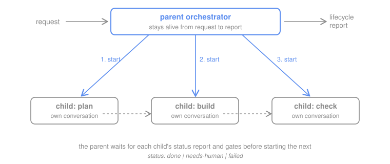
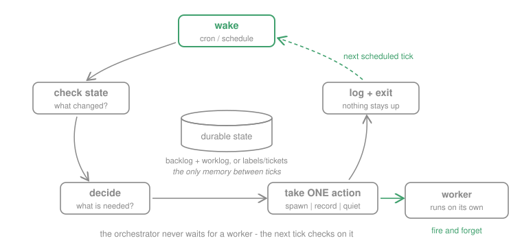
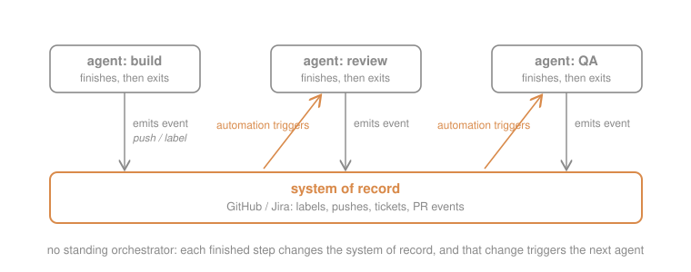

# Multi-Agent Orchestration Patterns for OpenHands

Runnable patterns for coordinating multiple OpenHands agents. Three ways to
build an agent workflow, split by one question: **who advances the work?**

- **Parent-Child:** a constantly running orchestrator drives a task from start
  to finish. It *waits* for each worker. Best for short-to-medium tasks.
- **Polling Loop:** a scheduled orchestrator wakes, nudges the work forward,
  and exits. It *never waits*. It checks back on the next tick. Best for
  long-running work.
- **Event-Driven Handoff:** no orchestrator at all. Each finished step changes
  the system of record, and *that change triggers* the next agent. Best when
  the workflow already lives in GitHub or Jira.

| | [Pattern 1: Parent-Child](patterns/parent-child/) | [Pattern 2: Polling Loop](patterns/polling/) | Pattern 3: Event-Driven Handoff |
| --- | --- | --- | --- |
| One line | Run a full lifecycle of child agents, **now** | Keep a backlog moving, **forever** | Let the system of record drive the work |
| Who advances the work | A live parent that stays up for the whole run | A scheduled tick that exits after one action | The event itself, no orchestrator |
| Shape | Parent delegates plan -> build -> check children and gates on each | Wake, observe state, take one action, exit | Agent finishes -> label/push/ticket change -> automation triggers the next agent |
| Memory | The live orchestrator + a run directory | Durable state on disk (or labels/tickets), no live process | The system of record itself |
| Use when | One request should produce one complete, visible result | Work spans hours/days and must survive crashes and restarts | Every step has a natural trigger and humans gate between steps |
| Production example | [sdlc-automation-github-demo](https://github.com/rajshah4/sdlc-automation-github-demo) (Jira ticket -> PR + review + QA) | [ohtv-workflow](https://github.com/jpshackelford/.openhands/tree/main/plugins/ohtv-workflow) (issue-to-merge on cron) | [sdlc-automation-github-demo](https://github.com/rajshah4/sdlc-automation-github-demo) step-by-step labels |

**Pattern 1: Parent-Child.** A live parent starts each child, waits for its
status report, and gates before starting the next. Children never talk to each
other.



**Pattern 2: Polling Loop.** A scheduled circle of work. Each tick wakes,
checks durable state, takes one action, and exits. Nothing runs between ticks.



**Pattern 3: Event-Driven Handoff.** No orchestrator. Each finished step
changes the system of record, and that change triggers the next agent.



## Quickstart

This section has a runnable example of the first two patterns, since they have 
an orchestrator to run. (Pattern 3 has no orchestrator. Its triggers live in
GitHub and Jira. See [its section](#pattern-3-event-driven-handoff).) 

Against OpenHands Cloud, Enterprise, or self-hosted (same API):

```bash
export OPENHANDS_API_KEY="your-key"
# export OPENHANDS_BASE_URL="https://openhands.your-company.com"   # if not app.all-hands.dev
```

Using local Agent Canvas instead? Skip the export and add `--runtime canvas`
to either script. The scripts find your local Canvas automatically. The key
is read from `~/.openhands/agent-canvas/api-key.txt`, the API is
`http://localhost:8000`, and every worker appears as a live conversation in
the Canvas UI.

**Pattern 1 - Parent-Child.** One command runs a three-cell lifecycle with
real child conversations and writes a lifecycle report:

```bash
cd patterns/parent-child
python3 run_supervisor.py --request "a Python function slugify(text) for URL-safe slugs"
cat runs/*/lifecycle-report.md
```

**Pattern 2 - Polling Loop.** Each command is one tick. Run it repeatedly and
watch the state machine advance through a seeded backlog:

```bash
cd patterns/polling
python3 orchestrate_once.py   # claims task-1, spawns a real worker, exits
python3 orchestrate_once.py   # worker still running -> quiet tick
python3 orchestrate_once.py   # worker done -> records result, next tick claims task-2
cat WORKLOG.md
```

The demo tasks are very small to highlight the pattern. You can run a real
software factory built on the same shapes in
[sdlc-automation-github-demo](https://github.com/rajshah4/sdlc-automation-github-demo).

Then read the code. Each orchestrator is one small stdlib-only file, and the
orchestration logic is the point of this repo:
[`run_supervisor.py`](patterns/parent-child/run_supervisor.py) shows the
start, wait, and gate loop.
[`orchestrate_once.py`](patterns/polling/orchestrate_once.py) shows the tick
decision (record, spawn, or stay quiet). The worker prompts in each
`prompts/` folder show the status-report format the orchestrators parse.

Both patterns run locally in Agent Canvas or on OpenHands Enterprise/Cloud.
The isolation model differs. Enterprise gives every worker conversation its
own sandbox. Agent Canvas conversations run on your machine, where they can
share a working directory (what this demo does) or attach a git repository
with a separate git worktree per conversation.


## The Ideas Underneath

Three transferable ideas carry all three patterns:

1. **Small status reports, not shared context.** Each worker gets a
   self-contained prompt and ends its reply with a short, fixed-format status
   report (`status:` / `summary:` / `next_gate:`). The orchestrator decides
   what happens next by reading those few lines alone. It never has to dig
   through everything the worker did.

2. **State placement is the design decision.** The parent-child orchestrator
   holds state in a live process. The polling loop holds it in durable
   records. Event-driven handoff goes all the way: state lives entirely in
   the system of record. Everything else follows from that choice: crash
   recovery, cost profile, and time horizon.

3. **Humans own the irreversible.** Workers never merge, deploy, or approve
   their own output. They do bounded work and report back. The orchestrator
   is the control point: the parent stops the lifecycle when a child reports
   `needs-human`, and the polling loop pauses whenever a human writes into
   `INSTRUCTIONS.md`. Final approval for irreversible actions stays with
   people.

## Pattern 3: Event-Driven Handoff

The third approach does not require an orchestrator. Instead, each agent
finishes by changing the **system of record**. It pushes a branch, adds a
label, or updates a ticket, and that change triggers the next agent through
an automation or webhook. Events advance the work.

The production example is the step-by-step path in
[sdlc-automation-github-demo](https://github.com/rajshah4/sdlc-automation-github-demo).
A human starts with one GitHub label (`openhands-build`), and the automations
continue the chain by adding the next labels (`openhands-review`,
`openhands-qa`). Each label triggers one bounded automation, and the results
land back on the issue or PR. The system of record is the workflow.


### Where the Original Demos Fit

This repo started by showing how to orchestrate multiple harnesses and
agents. Over time we see less demand for orchestrating harnesses, which is
why the patterns above now lead. The earlier harness demos still work, and
here is how each maps onto the patterns.

| Original demo | Which pattern is it? | What it grows into |
| --- | --- | --- |
| [`cloud_conversations.py`](cloud_conversations.py) | **Parent-child, simplified.** The script is a live parent that starts each Enterprise conversation and waits for it, just without gates. | Pattern 1 is its upgrade: add status reports and gate logic and you have `run_supervisor.py`. |
| [`multi_server_isolation.py`](multi_server_isolation.py) | **Parent-child today, event-driven in spirit.** The script still waits on each phase, but the handoff artifact is a git push, exactly the kind of event automations trigger on. | Remove the waiting script and let automations react to the pushes/labels instead: that is Pattern 3, and the sdlc label demo is precisely that, in production. |
| [`shared_workspace.py`](shared_workspace.py) | **Not an orchestration pattern. A runtime and harness choice.** Agents relay work inside one shared workspace, each picking up the previous agent's files. The sequencing is still done by a waiting script (parent-child shape). | Keep it as the **multi-harness proof**: Claude Code implements, Gemini CLI tests, OpenHands reviews, connected by ACP. Any of the three patterns can use this. A shared workspace and ACP workers are choices about *where workers run* and *what fills the worker slot*, not about who advances the work. |

Is the shared-workspace relay a real use case? Yes, but a narrow one: tight
sequential collaboration on one checkout (no re-cloning, no artifact passing)
where isolation between agents does not matter. You can do the same thing in
Agent Canvas with ACP-backed conversations sharing a working directory. Its
lasting value here is proving the worker slot is harness-agnostic. The
orchestration question is still answered by one of the three patterns above.

Run them:

```bash
# Shared workspace (SDK + ACP, three harnesses, one filesystem)
pip install openhands-sdk openhands-tools
export LLM_API_KEY="..." ANTHROPIC_API_KEY="..." GEMINI_API_KEY="..."
python shared_workspace.py               # or --no-claude for pure OpenHands delegation

# Isolated local clones (manual git orchestration, local pytest verification)
pip install openhands-ai pytest
python multi_server_isolation.py         # or --task csv-tool

# Cloud/Enterprise conversations (one sandbox per phase)
pip install requests
export OPENHANDS_CLOUD_API_KEY="your-cloud-api-key"
python cloud_conversations.py            # or --repo youruser/yourrepo
```

📖 [`PATTERNS.md`](PATTERNS.md) is the deep dive on these three runtime
setups, covering isolation and complexity trade-offs, decision trees, and
migration paths.

## Multi-Harness, ACP, and Agent Canvas

The workers in any of these patterns do not have to be OpenHands-native
agents, and you do not have to pick one harness for everything:

- **OpenHands Enterprise** runs each worker in its own conversation and
  sandbox, so different phases can use different models or harnesses without
  touching each other.
- **ACP (Agent Client Protocol)** lets a worker slot be filled by an outside
  harness such as Claude Code or Gemini CLI: the OpenHands SDK's `ACPAgent`
  wraps any ACP-speaking tool as a first-class agent. The working example is
  [`shared_workspace.py`](shared_workspace.py): three vendors, one control
  plane.
- **Subagents (SDK [TaskToolSet](https://docs.openhands.dev/sdk/guides/task-tool-set))**
  delegate *inside* one conversation: the parent launches a specialized
  subagent as a tool call, blocks until it returns its result, and can resume
  it later by task id with context preserved. Parent-child in miniature -
  right for bounded expert help mid-task (review this diff, plan these
  tests), not a replacement for child conversations when you want separate
  sandboxes and visible audit trails. The comparison table is in
  [choosing a pattern](docs/choosing-a-pattern.md#subagents-delegation-inside-one-conversation).
- **Agent Canvas** runs both patterns locally (`--runtime canvas`) and shows
  every worker as a live conversation you can open while it runs. Canvas and
  Enterprise expose different APIs (local conversations vs app-conversations
  with start tasks). This repo ships one backend for each with the same
  function surface, so the pattern scripts run on both unchanged.

Details and code: [Agent Canvas and ACP](docs/agent-canvas-and-acp.md).

## Repo Map

```text
patterns/
  common/openhands_conversations.py   # Cloud/Enterprise backend (app-conversations API)
  common/canvas_conversations.py      # local Agent Canvas backend (same surface)
  parent-child/                       # Pattern 1: run_supervisor.py + prompts + README
  polling/                            # Pattern 2: orchestrate_once.py + backlog + README
docs/
  choosing-a-pattern.md               # the decision guide + composition + state model
  agent-canvas-and-acp.md             # Canvas as visible runtime, ACP for harness mixing
tests/                                # contract tests; run offline: python3 -m pytest -q
```

## Links

- [OpenHands Cloud](https://app.all-hands.dev) - run and observe agent conversations
- [OpenHands SDK docs](https://docs.openhands.dev/sdk/overview) - build agent pipelines in Python
- [Agent Client Protocol (ACP)](https://docs.agentclientprotocol.com/) - the protocol connecting harnesses
