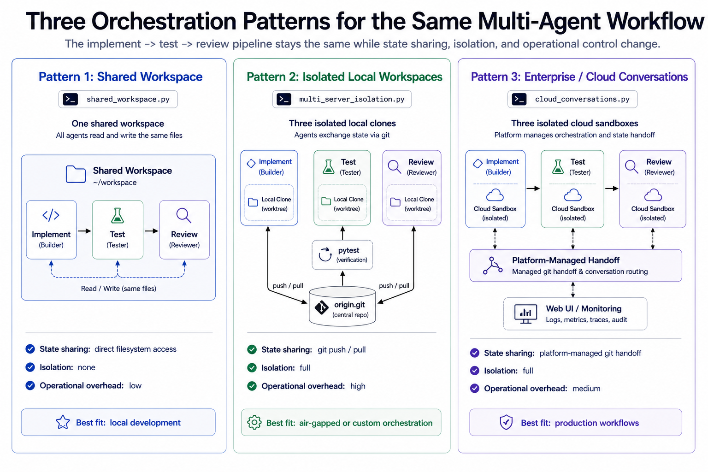

# Multi-Agent Orchestration Patterns for OpenHands

Two real, runnable patterns for coordinating multiple OpenHands agents. Both
spawn actual OpenHands conversations; both fit in one small Python file you
can read in five minutes; both split on a single question:

> **Does the orchestrator outlive the work, or does the work outlive the
> orchestrator?**

| | [Pattern 1: Supervisor](patterns/supervisor/) | [Pattern 2: Reconciler](patterns/reconciler/) |
| --- | --- | --- |
| One line | Run a full lifecycle of child agents, **now** | Keep a backlog moving, **forever** |
| Shape | Parent delegates plan -> build -> check children and gates on each | A scheduled tick observes state, takes one action, exits |
| Memory | The live orchestrator + a run directory | Durable state on disk (or labels/tickets) - no live process |
| Use when | One request should produce one complete, visible result | Work spans hours/days and must survive crashes and restarts |
| Production example | [sdlc-automation-github-demo](https://github.com/rajshah4/sdlc-automation-github-demo) (Jira ticket -> PR + review + QA) | [ohtv-workflow](https://github.com/jpshackelford/.openhands/tree/main/plugins/ohtv-workflow) (issue-to-merge on cron) |

Not sure which? [Choosing a pattern](docs/choosing-a-pattern.md) - two
questions decide it, and the patterns [compose](docs/choosing-a-pattern.md#compose-them):
a reconciler tick can spawn an entire supervisor lifecycle as its worker.

## Quickstart

Works against OpenHands Cloud, Enterprise, or self-hosted - same API:

```bash
export OPENHANDS_API_KEY="your-key"
# export OPENHANDS_BASE_URL="https://openhands.your-company.com"   # if not app.all-hands.dev
```

**Pattern 1 - Supervisor.** One command runs a three-cell lifecycle with real
child conversations and writes a lifecycle report:

```bash
cd patterns/supervisor
python3 run_supervisor.py --request "a Python function slugify(text) for URL-safe slugs"
cat runs/*/lifecycle-report.md
```

**Pattern 2 - Reconciler.** Each command is one tick; run it repeatedly and
watch the state machine advance through a seeded backlog:

```bash
cd patterns/reconciler
python3 orchestrate_once.py   # claims task-1, spawns a real worker, exits
python3 orchestrate_once.py   # worker still running -> quiet tick
python3 orchestrate_once.py   # worker done -> records result, next tick claims task-2
cat WORKLOG.md
```

The demo tasks are deliberately tiny so the *pattern* is the star. The same
shapes run a real software factory in
[sdlc-automation-github-demo](https://github.com/rajshah4/sdlc-automation-github-demo) -
same contracts, same gates, real branches and PRs.

## The Ideas Underneath

Three transferable ideas carry both patterns:

1. **Small contracts, not shared context.** Workers are bounded and blind: each
   gets a self-contained prompt and reports back a few parseable lines
   (`status:` / `summary:` / `next_gate:`). Orchestrators gate on the contract,
   never on a worker's event log.
2. **State placement is the design decision.** The supervisor holds state in a
   live orchestrator; the reconciler holds it in durable records. Everything
   else - crash recovery, cost profile, time horizon - follows from that
   choice. ([more](docs/choosing-a-pattern.md))
3. **Humans own the irreversible.** Workers never merge, deploy, or approve
   their own output. The supervisor stops on `needs-human`; the reconciler
   pauses when `INSTRUCTIONS.md` is non-empty.

## Agent Canvas and ACP

The worker slot in either pattern is harness-agnostic, and that is where
[Agent Canvas](docs/agent-canvas-and-acp.md) comes in:

- **Canvas makes the patterns visible.** Both scripts take `--runtime canvas`:
  the workers appear as separate live conversations you can open mid-run.
  Canvas exposes a different API than Cloud/Enterprise (local conversations vs
  app-conversations + start tasks); the repo ships one backend per API with the
  same surface, so the pattern code never notices.
- **ACP makes the workers swappable.** The OpenHands SDK's `ACPAgent` wraps any
  ACP-speaking harness - Claude Code, Gemini CLI - as a first-class agent, so a
  worker slot (or a Canvas node) does not have to be an OpenHands-native agent.
  The working proof is this repo's [`shared_workspace.py`](shared_workspace.py):
  three vendors, one control plane.

Details and code: [Agent Canvas and ACP](docs/agent-canvas-and-acp.md).

## Repo Map

```text
patterns/
  common/openhands_conversations.py   # Cloud/Enterprise backend (app-conversations API)
  common/canvas_conversations.py      # local Agent Canvas backend (same surface)
  supervisor/                         # Pattern 1: run_supervisor.py + prompts + README
  reconciler/                         # Pattern 2: orchestrate_once.py + backlog + README
docs/
  choosing-a-pattern.md               # the decision guide + composition + state model
  agent-canvas-and-acp.md             # Canvas as visible runtime, ACP for harness mixing
tests/                                # contract tests; run offline: python3 -m pytest -q
```

---

## Appendix: Runtime and Harness Demos (Linear Pipeline)

Before the pattern framing, this repo demonstrated one linear
implement -> test -> review pipeline across three *runtime* setups. They still
run, and they remain the reference for two questions the patterns defer:
"how isolated are my agents?" and "can I mix harnesses?"



| Script | Runtime | Notable |
| --- | --- | --- |
| [`shared_workspace.py`](shared_workspace.py) | One shared SDK workspace | Claude Code + Gemini CLI + OpenHands via ACP - the harness-mixing proof |
| [`multi_server_isolation.py`](multi_server_isolation.py) | N isolated local clones | Explicit git handoffs between phases; air-gap friendly |
| [`cloud_conversations.py`](cloud_conversations.py) | Cloud/Enterprise conversations | One managed sandbox per phase, web UI per agent |

Run them:

```bash
# Shared workspace (SDK + ACP; three harnesses, one filesystem)
pip install openhands-sdk openhands-tools
export LLM_API_KEY="..." ANTHROPIC_API_KEY="..." GEMINI_API_KEY="..."
python shared_workspace.py               # or --no-claude for pure OpenHands delegation

# Isolated local clones (manual git orchestration, local pytest verification)
pip install openhands-ai pytest
python multi_server_isolation.py         # or --task csv-tool

# Cloud/Enterprise conversations (one sandbox per phase)
pip install requests
export OPENHANDS_CLOUD_API_KEY="your-cloud-api-key"
python cloud_conversations.py            # or --repo youruser/yourrepo
```

📖 [`PATTERNS.md`](PATTERNS.md) is the full guide to the runtime axis:
isolation vs. complexity trade-offs, decision trees, and migration paths. The
workflow patterns above are independent of it - any pattern can run on any
runtime.

## Links

- [OpenHands Cloud](https://app.all-hands.dev) - run and observe agent conversations
- [OpenHands SDK docs](https://docs.openhands.dev/sdk/overview) - build agent pipelines in Python
- [Agent Client Protocol (ACP)](https://docs.agentclientprotocol.com/) - the protocol connecting harnesses
