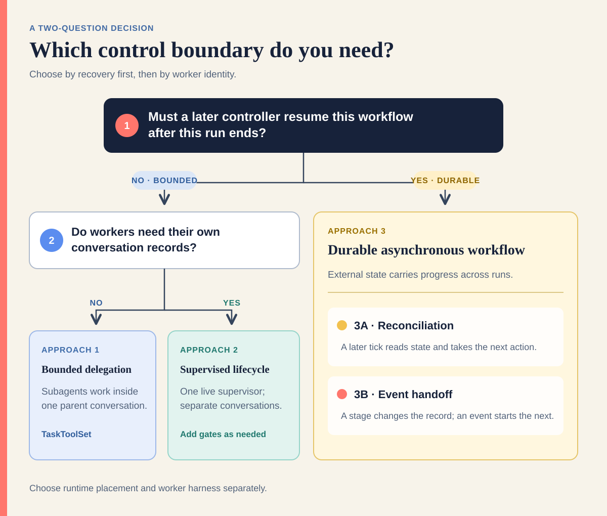

# Choosing an Approach

Choose the control boundary first. Runtime placement, worker harness, trigger,
and storage technology are separate decisions.



## The Three Approaches

| Approach | Controller lifetime | Worker identity | Workflow state | Use when |
| --- | --- | --- | --- | --- |
| **1. Bounded in-conversation delegation** | One parent run remains active | Subagents are delegated work inside the parent conversation | Parent history, task IDs, and optional Git artifacts | A bounded request needs specialist help and can wait |
| **2. Bounded supervised lifecycle** | One live supervisor remains active | Workers are first-class conversations with separate histories | Parent run record, child IDs, final-response contracts, and durable artifacts | One bounded request needs visible workers and gates |
| **3. Durable asynchronous workflow** | No controller must remain active for the whole workflow | Usually first-class worker conversations or bounded stage runs | External durable state survives every controller invocation | Work spans runs, systems, CI, or human decisions |

The approaches are composable. They are not runtime products and they do not
imply a particular sandbox layout.

## Decide in Two Questions

### 1. Can one parent remain accountable until the request is complete?

- **No:** choose [Approach 3](#3-durable-asynchronous-workflow). External state
  must carry progress between controller runs.
- **Yes:** continue to question 2.

### 2. Do workers need independent conversation identities and gates?

- **No:** choose [Approach 1](#1-bounded-in-conversation-delegation). Delegate
  bounded specialist work inside the parent conversation.
- **Yes:** choose [Approach 2](#2-bounded-supervised-lifecycle). Keep one live
  supervisor and create first-class child conversations.

## 1. Bounded In-Conversation Delegation

The OpenHands SDK's
[TaskToolSet](https://docs.openhands.dev/sdk/guides/task-tool-set) lets a parent
agent launch a specialized subagent as a tool call inside its conversation. The
parent waits for the result and can resume the subagent later by task ID.
Specializations such as a reviewer, test planner, or domain expert register
with `register_agent()`.

Use this approach when an agent needs bounded expert help and can wait for the
answer. A TaskToolSet subagent should normally be a leaf delegate: the parent
conversation owns the delegation layer.

A related but different knob is
[parallel tool execution](https://docs.openhands.dev/sdk/guides/parallel-tool-execution).
Increasing `tool_concurrency_limit` can fan out independent subagent tool calls,
but it does not change who owns progress. Calls that modify shared state or the
same files are not safe to run concurrently.

## 2. Bounded Supervised Lifecycle

A live supervisor starts first-class child conversations, waits for their final
responses, validates small result contracts, and advances only when the next
gate permits it. The runnable
[parent-child controller](../patterns/parent-child/) demonstrates this shape.

| Boundary | Approach 1 subagent | Approach 2 child conversation |
| --- | --- | --- |
| Identity | A tool call inside the parent's event stream | A separate conversation record and URL |
| Blocking | The parent blocks until the subagent call returns | The supervisor chooses when to wait and gate |
| Handoff | Prompt in, result text out; resumable by task ID | Final-response contract plus durable Git or ticket artifacts |
| Placement | Normally the parent's runtime; worktrees may narrow file sharing | Shared, grouped, or isolated placement depending on backend configuration |
| Use when | Bounded expert help inside one task | Lifecycle stages need visibility, separate histories, or human gates |

A first-class conversation does not itself guarantee a separate sandbox.
Conversation identity is an ownership and audit boundary; sandbox placement is
a compute, filesystem, credential, timeout, and failure boundary.

## 3. Durable Asynchronous Workflow

Choose this approach when the logical workflow outlives every controller run.
Tasks, attempts, active workers, results, gates, and the next permitted action
must live in a durable system of record.

### 3A. Reconciliation

A temporary controller wakes, reads durable state, observes actual progress,
takes one bounded convergent action, checkpoints, and exits. The next tick can
recover after a crash because it reads external truth rather than relying on a
previous process.

Use reconciliation for a changing backlog, capacity management, retries, or
conditions that need periodic observation. The runnable
[polling controller](../patterns/polling/) is the smallest example. The
[ohtv-workflow plugin](https://github.com/jpshackelford/.openhands/tree/main/plugins/ohtv-workflow)
and [Vibe Manager](https://github.com/rbren/vibe-manager) are larger examples
with first-class worker conversations.

### 3B. Event Handoff

A bounded stage finishes by changing the system of record—a push, label, PR,
ticket transition, or validated artifact. That event starts the next bounded
stage through an automation or webhook. No controller spans the entire chain.

Use event handoff when each stage has a natural external trigger. The
[SDLC Automation Demo](https://github.com/rajshah4/sdlc-automation-github-demo)
uses GitHub labels and PR events for build, review, and QA stages.

A single event that merely starts one bounded Approach 1 or Approach 2 run does
not become Approach 3. The workflow qualifies as Approach 3 when later runs
must recover and continue the same durable lifecycle.

## Compose the Approaches

A durable backlog controller can start one bounded supervised lifecycle, whose
workers use bounded subagents internally:

```text
Approach 3 reconciliation tick
  -> observes ticket KAN-42 is ready
  -> starts one Approach 2 lifecycle
       -> implementation child
            -> Approach 1 research subagent
            -> Approach 1 test-planning subagent
       -> review child
       -> QA child
  -> exits
next tick observes the durable lifecycle result
```

The outer layer owns campaign progress. The middle layer owns one request. The
inner layer owns one specialist task.

## Choose Placement Separately

Where workers run determines sharing and risk, not the orchestration approach:

- **Shared working tree:** direct file handoff, fast, but coupled and not safe
  for conflicting parallel writes.
- **Git worktrees or isolated clones:** file isolation on a shared host; compute,
  credentials, and failure scope may still be shared.
- **Grouped managed conversations:** separate histories with shared runtime
  capacity; grouping is not a security boundary.
- **Isolated sandboxes:** strongest compute, credential, timeout, and failure
  separation; code and evidence move through Git or another durable system.

See [Execution Boundaries and Runtime Placement](../PATTERNS.md) for the full
trade-off guide.

## Choose State and Judgment Separately

Conversation history helps an agent reason, but it should not be the only
campaign record. Use final responses for bounded handoffs and a durable system
such as automation KV, Git, GitHub, Jira, or an application database for work
that must survive controller failure.

Independent of approach, decisions may be:

- **Deterministic code:** cheap, reproducible, and appropriate for mechanical
  transitions such as the next pending task or a status gate.
- **An LLM following a skill:** useful when state is natural language and the
  decision requires interpretation.
- **Hybrid:** a deterministic watcher invokes a model only when changed state
  requires judgment.

Start deterministic. Add model judgment where mechanical rules stop being
enough.
